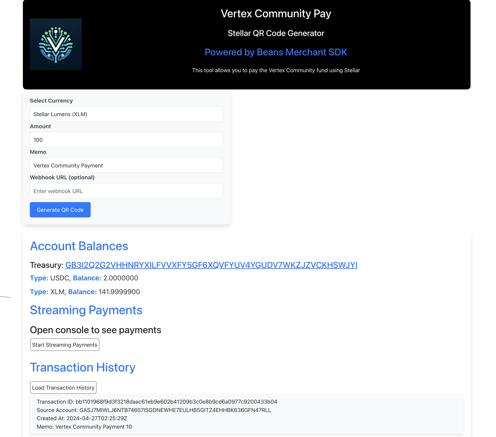
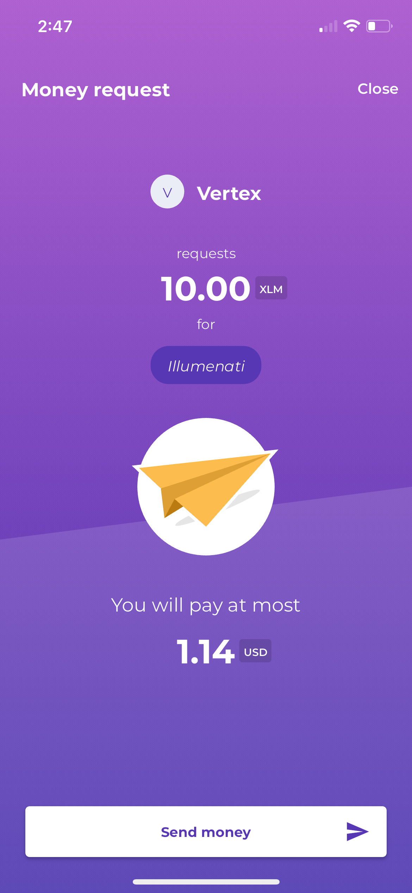

# Beans Merchant SDK React App

This repository contains a React app boilerplate designed for the Beans Merchant SDK. It allows users to generate QR codes for payments in USDC or XLM on the Stellar network. The app leverages the Stellar SDK to provide functionalities such as balance checking and payment streams.

In this Demo, we have created a simple React app that generates QR codes for payment requests for the Vertex community wallet. The app allows users to specify the amount and memo for each payment. Users can then scan the generated QR code to complete the payment with the Beans app.

This repo is intended to serve as a starting point for developers looking to integrate the Beans Merchant SDK into their applications. It provides a basic structure for creating payment requests and handling payment data on the Stellar network.



## Features

- **QR Code Generation**: Easily create QR codes for payment requests.
- **Currency Selection**: Choose between USDC and XLM for payments.
- **Payment Customization**: Specify the amount and memo for each payment request.
- **Real-Time Updates**: Utilize the Stellar SDK to monitor account balances and payment streams.

## Prerequisites

- Node.js (v18 or higher)

## Getting Started

To get a local copy up and running, follow these simple steps.

### Installation

Clone the repo and install the dependencies:

```bash
git clone https://github.com/Julian-dev28/Beans-merchant-sdk-react-boilerplate
cd Beans-merchant-sdk-react-boilerplate
yarn install
```

# Usage

Start the application:

```bash
yarn start
```

To make a payment:

1. Choose the currency and specify the amount and memo for the QR code.<br/>
1. Scan the QR code using the Beans app.<br/>
1. Open the Beans app and accept the transaction to complete the payment.<br/>
   <br/>

   

# Contributing

Please feel free to contribute to this project. The SDF welcomes contributors to assist in enhancing the interoperability of ecosystem tools with their respective parts in the Stellar stack.

# Additional Resources

- [Beans Merchant SDK Documentation](https://github.com/Beans-BV/merchant_sdk_javascript)

# Support

For support, please open an issue through the repository.
